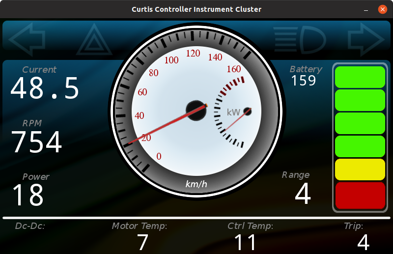

# Curtis-Dashboard
Use a Raspberry Pi with 7" touchscreen to present useful info via CANbus from a Curtis 1239 controller.

It will be used as the instrument cluster on a EV conversion of a Harley-Davidson Streetrod

